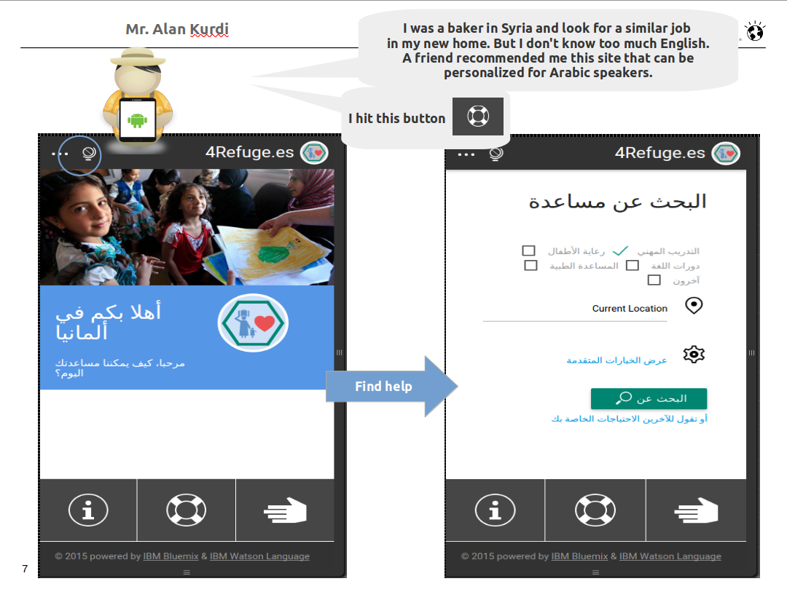

## Wer sind wir?

Wir sind eine Kanadische/Deutsche Familie in Malmsheim, die einfach unser Zuhause liebt. Unsere Leidenschaft gilt dem Umweltschutz und dem Fortschritt der Gesellschaft durch Technologie, beispielsweise durch die Anwendung von KI in der Medizin, selbstfahrenden Autosystemen und bei der Unterstützung für Flüchtlinge (Abbildung 1.). Sie finden unsere LinkedIn-Profile hier: [Nicole Finnie](https://www.linkedin.com/in/nicolefinnie/) u. [Liam Finnie](https://www.linkedin.com/in/jliamfinnie/).

<figure markdown>
  { width="800" }
  <figcaption>Abbildung 1. Die Flüchtlings-App, die wir 2015 mit dem IBM Watson Sprachdienst privat entwicklet haben, um Online-Übersetzungen von Deutsch nach Arabisch und umgekehrt durchzuführen, bevor Chat-GPT 2022 auf den Markt kam. </figcaption>
</figure>

Wir machen uns Sorgen darüber, welche Art von Welt wir unseren Kindern hinterlassen werden, und möchten mit Hilfe der Technologie einen positiven Einfluss auf unsere Umwelt nehmen.

## Unser Haftungsausschluss 

Diese Seite steht in keiner Verbindung zur Stadt Renningen, zu Unternehmen, Organisationen, unseren Arbeitgebern oder politischen Parteien. Da die Glaubwürdigkeit einer Website in Deutschland von entscheidender Bedeutung ist, beachten Sie bitte unser [Impressum](impressum.md).

## How to Contribute?

This website is generated using [mkdocs](https://www.mkdocs.org/) and hosted on the [Github server](https://github.com/). If you want to contribute, feel free to open a pull request at [our github repo](https://github.com/nicolefinnie/we-care-renningen). We'd probably just approve it. :D
(We left this section in English, because English is the common language in our field.)
