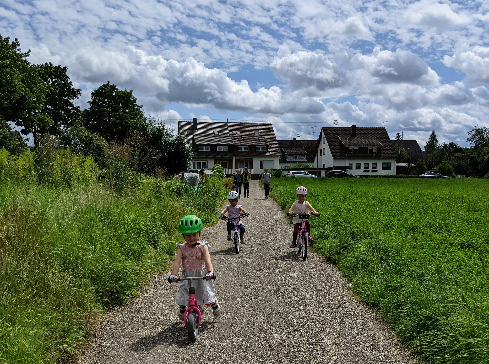
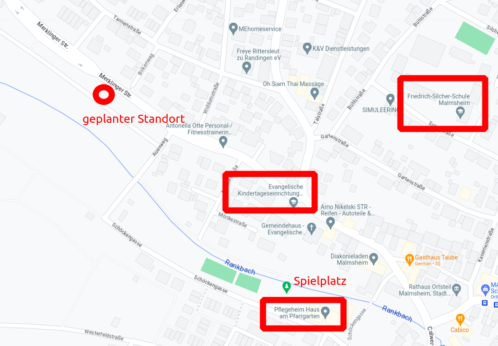
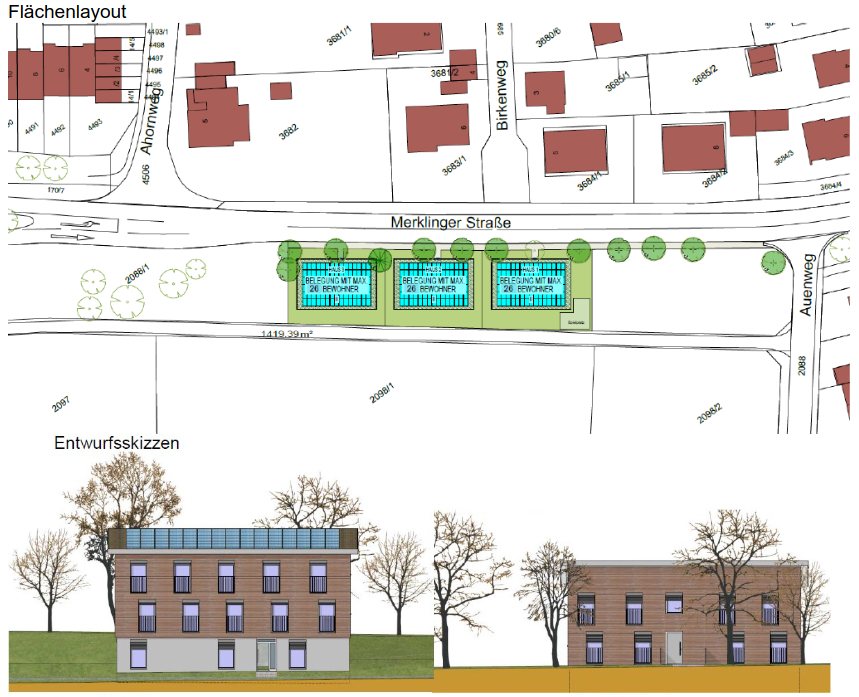

## Anschlussunterbringung von Flüchtlingen in Renningen/Malmsheim

Am 22.05.2023 traf der Gemeinderat Renningen einen Grundsatzbeschluss ([Gemeinderatssitzung am 22.05.2023](https://sessionnet.renningen.de/bi/si0057.php?__ksinr=412)), dass sie die Flüchtlingscontainer erhöhen und neue Flüchtlingsheime in Renningen und Malmsheim bauen werden. Wir möchten darauf hinarbeiten, dass unsere Nachbarschaft umfassend über den vorliegenden Grundsatzbeschluss informiert ist.

### Standort - Krautgärten auf der Merklinger Straße 

Ein Standort in den Krautgärten auf der Merklinger Straße befindet sich in einem Auengebiet, der als Überflutungsbecken dient und bei Kindern und Familien in Malmsheim sehr beliebt ist.(Abbildung 1 u. Abbildung 2). 


<figure markdown>
  { width="500" }
  <figcaption>Abbildung 1. Standort Krautgärten Merklinger Strasse im Auengebiet Malmsheim</figcaption>
</figure>

### Sollen wir in Natur mehr Häuser bauen?

Das zur Bebauung vorgesehene Gelände ist Teil der Auenlandschaft des Rankbaches. Diese Auenlandschaft fungiert nicht nur als Flutbecken, um Überflutungen in Malmsheim abzuwehren, sie repräsentiert zudem einen unerlässlichen Baustein des Rankbach-Ökosystems. Sie bietet zahlreichen Insekten und Tieren einen wertvollen Lebensraum.

Die Bebauung von Auenlandschaften kann zu einer Versiegelung der betroffenen Gebiete führen, was das Potenzial hat, ihre essentiellen ökologischen Funktionen einzuschränken. Im Kontext des voranschreitenden Klimawandels und der damit verbundenen Krise ist dies ein Faktor, den es ernsthaft zu berücksichtigen gilt. Auf Landesebene ist die Tendenz zur Wiederherstellung von Auenlandschaften gegenwärtig vorherrschend.

Für mehr Informationen über Auenlandschaft, besuchen Sie bitte [Naturschutz und Umwelt](naturschutz.md).

<figure markdown>
  { width="1000" }
  <figcaption>Abbildung 2. Standort Krautgärten Merklinger Strasse am GoogleMaps. Der Standort befindet sich in einem Auengebiet. </figcaption>
</figure>

Laut Quelle A1 hat der Gemeinderat eine Machbarkeitsstudie (Abbildung 3) durchgeführt. Die Stadt würde angeblich nur mit einem Haus beginnen, doch sobald das erste Haus errichtet ist, wurde die Natur bereits zerstört, sodass es der Stadt leichter fällt, ein weiteres zu bauen. Statistisch gesehen wird die Anzahl der Flüchtlinge nicht sinken, sondern steigen (Quelle A2 von BAMF), so dass eine Ausweitung der Anzahl der Häuser unvermeidlich ist. Wir verstehen voll und ganz, dass die Stadt verpflichtet ist, einen gerechten Anteil an Flüchtlingen aufzunehmen, aber ist der Neubau von Häusern die beste Lösung? Und wenn es die beste Lösung ist, ist der gewählte Standort der beste Standort sowohl für bestehende Bewohner als auch für Neuankömmlinge?

Wir möchten der Stadt folgende Fragen stellen:

* Müssen wir die Natur zerstören und den Zugang der Bewohner zur Natur einschränken?
* Ist dies der beste Ort, um unsere neuen Bewohner in die Gesellschaft zu integrieren?
* Wie können Sie sicherstellen, dass die Bewohner unbeschränkten Zugang zur Natur haben? Die Bewohner würden den Zugang zu diesem wichtigen Wanderweg verlieren, auf dem wir unsere Hunde spazieren führen, unsere kleinen Kinder das Radfahren beibringen, zum Wald joggen und wo unsere Senioren aus dem nahegelegenen Seniorenheim die Natur genießen.

<figure markdown>
  { width="1000" }
  <figcaption>Abbildung 3. Machbarkeitsstudie: Flächenlayout des Standorts Krautgärten Merklinger Strasse. Quelle A1.</figcaption>
</figure>

- a) Platz für ca. 29 Personen je Mustergebäude gemäß Testentwurf, Wohnfläche ca. 357 m² 
- b) geschätzte Baukosten je Gebäude (incl. PV-Anlage mit Speicher): 2.665.000 € bei 3 Gebäuden für 87 Personen somit rd. 8,0 Mio. €
- c) Fertigstellung möglich bis ca. 3. Quartal 2025


### Petition gegen den Standort Krautgärten

Sollten Sie Bedenken hegen oder Vorschläge einbringen wollen, wenden Sie sich bitte an Ihre Vertretung im [Gemeinderat](https://sessionnet.renningen.de/bi/kp0041.php). 

Des Weiteren haben Sie die Möglichkeit, die [Unterschriftenliste A2](res/Widerspruch_Beschlussfassung_20881.pdf) herunterzuladen, zu unterzeichnen und an die folgende Adresse zu übersenden. 
 
```
Gemeinderat Stadt Renningen
Hauptstraße 1
71272 Renningen
```

Oder unterschreiben Sie unsere online petition, besuchen Sie bitte [Petition](petition.md)


### Herunterladen 

* A1. Wenn Sie mehr über diesen Grundsatzbeschluss erfahren möchten, sehen Sie bitte  [Anschlussunterbringung von Menschen mit Fluchterfahrung ](https://sessionnet.renningen.de/bi/getfile.php?id=13613&type=do).
* A2. Bundesamt für Migration und Flüchtlinge: [Aktuelle Zahlen](https://www.bamf.de/SharedDocs/Anlagen/DE/Statistik/AsylinZahlen/aktuelle-zahlen-juni-2023.pdf?__blob=publicationFile&v=2)
* A3. Unser Flyer [in PDF](res/flyer.pdf)


