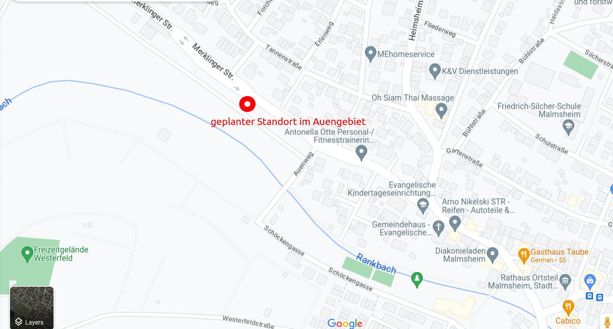

## Anschlussunterbringung von Flüchtlingen in Renningen/Malmsheim

Am 22.05.2023 traf der Gemeinderat Renningen einen Grundsatzbeschluss ([Gemeinderatssitzung am 22.05.2023](https://sessionnet.renningen.de/bi/si0057.php?__ksinr=412)), dass sie die Flüchtlingscontainer erhöhen und neue Flüchtlingsheime in Renningen und Malmsheim bauen werden. Ein Standort am Kräutergarten auf der Merklinger Straße ist bei Kindern und Familien in Malmsheim sehr beliebt (Fig. 1), in der Nähe einer Grundschule, eines Kindergartens, eines Spielplatzes und eines Seniorenheims (Fig. 2). Wir möchten, dass unsere Nachbarn besser über diesen Grundsatzbeschluss informiert sind. Wenn Sie Bedenken oder Vorschläge haben, sprechen Sie bitte mit Ihrem [Gemeinderatvertreter](https://sessionnet.renningen.de/bi/kp0041.php).

<figure markdown>
  { width="500" }
  <figcaption>Fig 1. Krautgärten Merklinger Strasse, ein geliebter Ortsteil Malmsheim für Kinder und Familien, wo der neue Flüchtlingswohnheim geplant ist.</figcaption>
</figure>

<figure markdown>
  { width="1000" }
  <figcaption>Fig 2. Standort Krautgärten Merklinger Strasse am GoogleMaps. Der Standort ist in der Nähe einer Grundschule, eines Kindergartens, eines Spielplatzes und eines Seniorenheims.</figcaption>
</figure>

<figure markdown>
  { width="600" }
  <figcaption>Fig 3. Standort Krautgärten Merklinger Strasse. Quelle A1.</figcaption>
</figure>

- a) Platz für ca. **29 Personen je Mustergebäude** gemäß Testentwurf, Wohnfläche ca. 357 m² 
- b) geschätzte Baukosten je Gebäude (incl. PV-Anlage mit Speicher): 2.665.000 € bei 3 Gebäuden für **87 Personen** somit rd. **8,0 Mio. €**
- c) Fertigstellung möglich bis ca. **3. Quartal 2025**

### Herunterladen 

* A1. Wenn Sie mehr über diesen Grundsatzbeschluss erfahren möchten, sehen Sie bitte  [Anschlussunterbringung von Menschen mit Fluchterfahrung ](https://sessionnet.renningen.de/bi/getfile.php?id=13613&type=do).

* A2. [Unterschriftenliste für Widerspruch zur Beschlussfassung](res/Widerspruch_Beschlussfassung_20881.pdf) zum Bau von AU-Unterkünften auf den Grundstücken Flst.Nr. 2088/1 (Krautgärten Merklinger Strasse Fig 1.). Wenn Sie diesen Widerspruch unterschreiben wollen, laden Sie bitte die Unterschriftenliste herunter.

