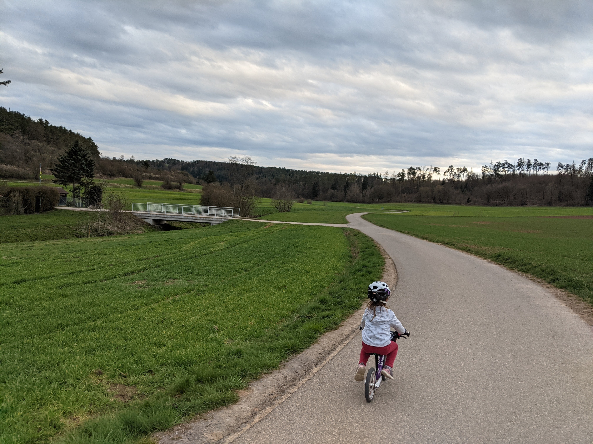

## Umwelt und Naturschutz

### Auen - Hochwasservorsorge

Auen zählen zu den Ökosystemen mit der größten Artenvielfalt auf unserem Planeten. Diese natürlichen Überflutungsgebiete entlang Flüssen oder Bächen stellen durch Wasser geformte Lebensräume dar und dienen als Verbindungsglieder zwischen verschiedenen Landschaften. Jedoch sind Auen weltweit bedroht: Indem wir Flüsse kanalisieren, ihre Auen entziehen und Landschaften entwässern, setzen wir sie unter Druck. Dies hat weitreichende Auswirkungen auf das gesamte Flussökosystem, einschließlich der Tier- und Pflanzenwelt, und letztlich auch auf uns Menschen.

<figure markdown>
  { width="500" }
  <figcaption>Fig 1. Auen in Malmsheim</figcaption>
</figure>

- [Auen: Artenreichtum entlang der Flüsse](https://www.wwf.de/themen-projekte/fluesse-seen/lebensraeume/auen)

- [Bundesfachausschuss Lebendige Flüsse](https://www.nabu.de/natur-und-landschaft/fluesse/bfa.html)

- [Den Flüssen mehr Raum geben](https://www.bmuv.de/fileadmin/Daten_BMU/Pools/Broschueren/auen_in_deutschland_bf.pdf)

- [Klimakrise in Baden-Württemberg: Mehr Flächen für die Auen-Renaturierung](https://www.bund-bawue.de/service/pressemitteilungen/detail/news/mehr-flaechen-fuer-die-auen-renaturierung/)

- [Hochwasservorsorge in der Raumordnung](https://www.hochwasser.baden-wuerttemberg.de/raumordnung)